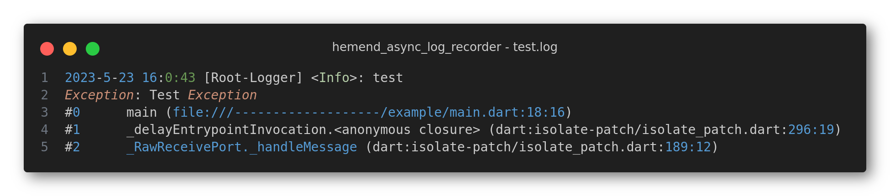
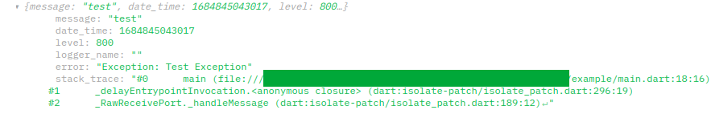

# Hemend Async Logger

[![License: MIT][license_badge]][license_link]
[][pub_link]
[][pub_link]
[][pub_link]
[][git_link]
[][git_link]
[](https://github.com/FMotalleb/hemend_async_log_recorder/actions/workflows/main.yaml)
[](https://github.com/FMotalleb/hemend_async_log_recorder/actions/workflows/publish.yaml)

The presented software package expands upon the existing functionality of the hemend_logger package, which can be found at <https://pub.dev/packages/hemend_logger>. This extension enhances the capabilities of the package by introducing asynchronous logging functions that enable the recording of logs using various methods, such as post requests, websockets, files, and more.

At its current state, the package includes built-in support for post request, web socket and file logging functionalities, allowing users to seamlessly utilize these mechanisms for recording logs.





## Installation 💻

**❗ In order to start using Hemend Async Logger you must have the [Dart SDK][dart_install_link] installed on your machine.**

Add `hemend_async_log_recorder` and `hemend_logger` to your`pubspec.yaml`:

```yaml
dependencies:
  hemend_logger: <latest-version>
  hemend_async_log_recorder: <latest-version>
```

Install it:

```sh
dart pub get
```

---

## Usage

Just add desired logger to the hemend_logger instance and start logging

```dart
HemendLogger.defaultLogger()
  ..addListener(
    HemendAsyncLogRecorder.post(postUrl: 'https://<Server>/record'),
  )
  ..addListener(
    HemendAsyncLogRecorder.file(filePath: 'example/test.log'),
  );
```

---

## Continuous Integration 🤖

Hemend Async Logger comes with a built-in [GitHub Actions workflow][github_actions_link] powered by [Very Good Workflows][very_good_workflows_link] but you can also add your preferred CI/CD solution.

Out of the box, on each pull request and push, the CI `formats`, `lints`, and `tests` the code. This ensures the code remains consistent and behaves correctly as you add functionality or make changes. The project uses [Very Good Analysis][very_good_analysis_link] for a strict set of analysis options used by our team. Code coverage is enforced using the [Very Good Workflows][very_good_coverage_link].

[dart_install_link]: https://dart.dev/get-dart
[github_actions_link]: https://docs.github.com/en/actions/learn-github-actions
[license_badge]: https://img.shields.io/badge/license-MIT-blue.svg
[license_link]: https://opensource.org/licenses/MIT
[very_good_analysis_link]: https://pub.dev/packages/very_good_analysis
[very_good_coverage_link]: https://github.com/marketplace/actions/very-good-coverage
[very_good_workflows_link]: https://github.com/VeryGoodOpenSource/very_good_workflows
[git_link]: https://github.com/FMotalleb/hemend_async_log_recorder
[pub_link]: https://pub.dev/packages/hemend_async_log_recorder
